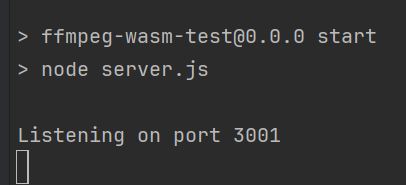
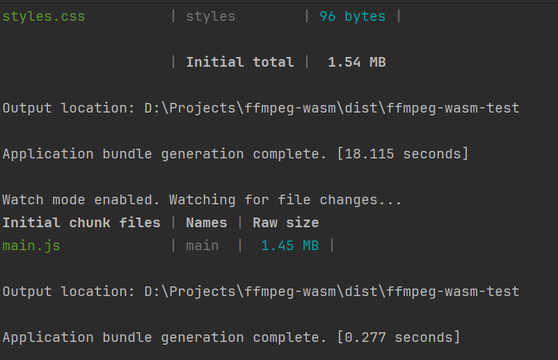
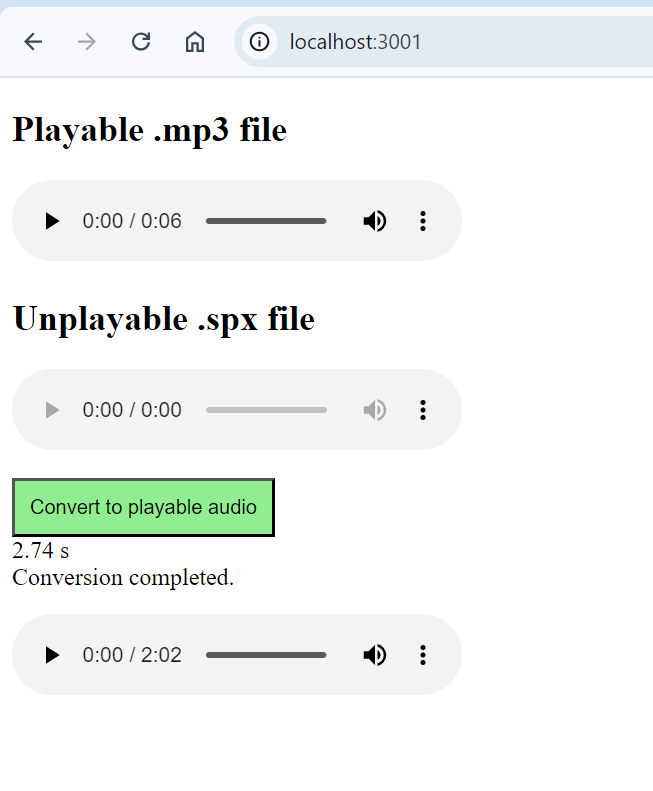

# ffmpeg-wasm
Convert any audio format to .mp3 using FFmpeg in a WebAssembly module within Angular. Ensure compatibility with the HTML5 audio tag for seamless audio playback in the browser

## Run
Run `npm run start` in your main directory
### *Output of above command*

## Want to watch compiled changes?
If yes, please run `npm run watch` in your main directory
### *Output of above command*

Hit *http://localhost:3001/* in browser URL

# UI

